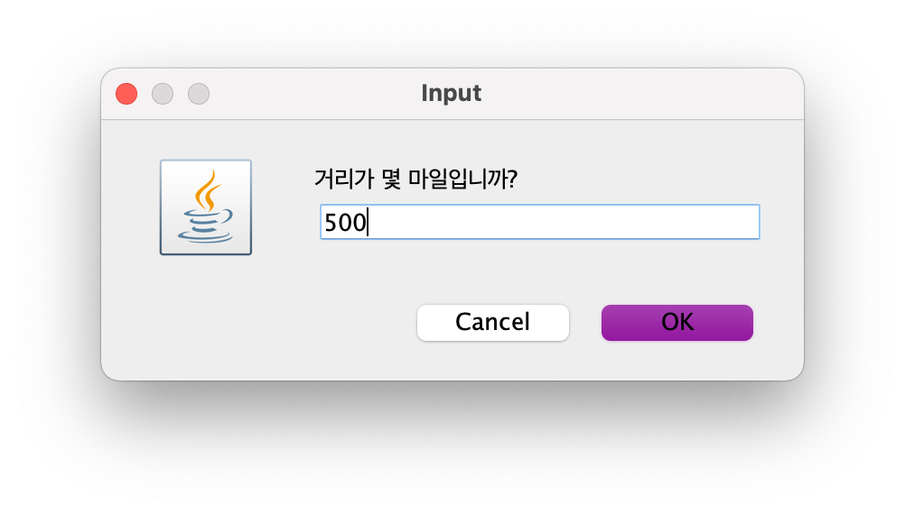
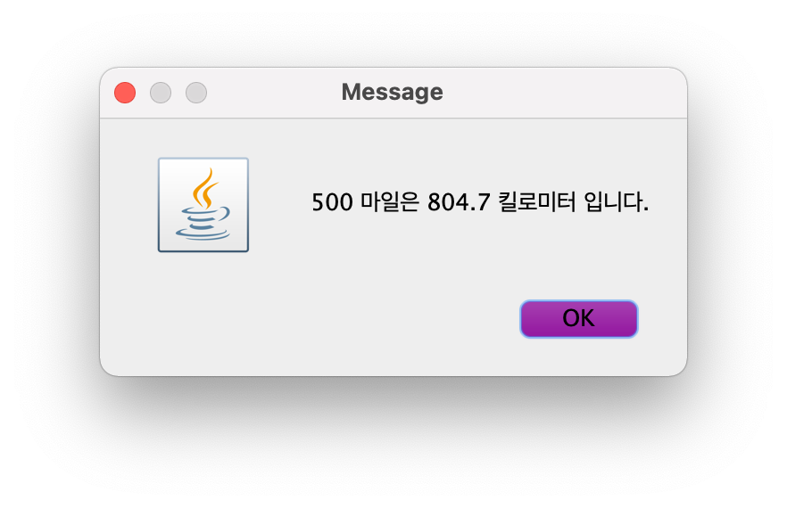
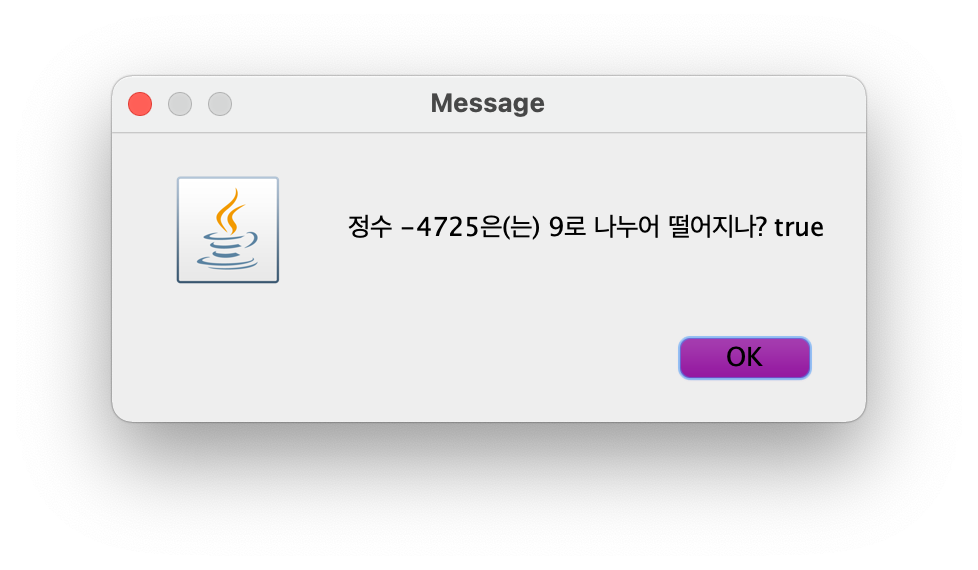
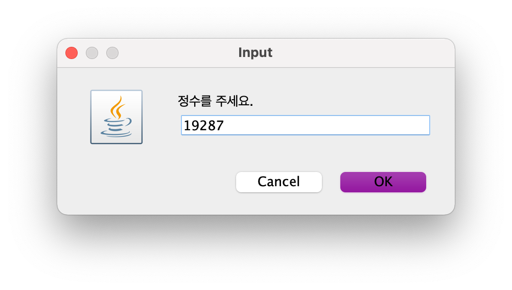
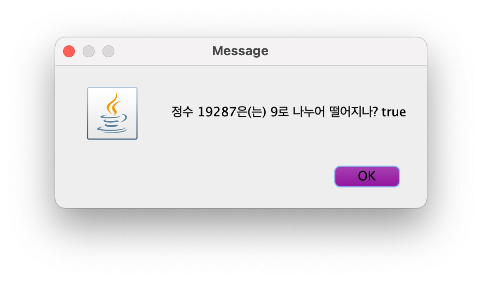

# [CSE2016] 2024년도 가을학기 프로그램설계방법론
## 한양대학교 ERICA 소프트웨어융합대학 컴퓨터학부 & 인공지능학과

- `javax.swing` 패키지의 `JOptionPane`이 제공하는 `showInputDialog` 메소드를 활용하여 입력창으로 사용자 입력을 받고, 계산 결과는 `showMessageDialog` 메소드를 활용하여 메시지 창에 출력하는 애플리케이션을 만드는 연습입니다.
- 실습 시간 안에 완성하여 조교에게 검사를 받습니다.

## [실습 2-1] 마일을 킬로미터로 환산

영미권에서는 세계 표준과 다른 계량 단위를 사용한다. 거리는 `km` 대신 `mile`을 사용하는데, 1 mile은 1.60934 km 이다.

`mile` 단위 거리를 정수로 입력받아 `km` 단위로 환산하여 다음과 같은 형식으로 메시지 창에 보여주는 애플리케이션을 아래 뼈대 코드 형식에 맞추어 작성하자. 환산한 거리는 소수점 첫째자리 까지만 표현한다.





```java
import javax.swing.JOptionPane;

public class Mi2Km {
    public static void main(String[] args) {
        // TODO
    }
}
```

## [실습 2-2] 9로 나누어 떨어지는 수인지 쉽게 확인하기

`-99999`과 `99999` 사이의 정수를 입력받아 그 수가 9로 나누어 떨어지는지 다음과 같은 형식으로 메시지 창에 보여주는 애플리케이션을 아래 뼈대 코드 형식에 맞추어 작성하자.




```java
import javax.swing.JOptionPane;

public class DivisibleBy9 {
    public static void main(String[] args) {
        // TODO
    }
}
```

#### * 힌트

어떤 수를 9로 나눈 나머지가 `0`과 같으면, 그 수는 9로 나누어 떨어진다.

## [실습 2-3] 9로 나누어 떨어지는 수인지 힘들게 확인하기

정수는 다음 성질을 만족한다.

> 자리별 숫자의 합이 9로 나누어 떨어지면 그 수는 9로 나누어진다.

예를 들어 9로 나누어 떨어지는 `423`, `-4725`, `19287`은 모두 자리별 숫자의 합이 각각 `9`, `18`, `27`로 9로 나누어 떨어진다.

- `423` : 4 + 2 + 3 = 9
- `-4725` : 4 + 7 + 2 + 5 = 18
- `19287` : 1 + 9 + 2 + 8 + 7 = 27

`-99999`와 `+99999` 사이의 <u>**다섯자리**</u> 정수를 프로그램 인수로 받아, 자리별 숫자의 합이 9로 나누어 떨어지는지 다음과 같은 형식으로 메시지 창에 보여주는 애플리케이션을 위의 성질을 이용하여 아래 뼈대 코드 형식에 맞추어 작성하자.





```java
import javax.swing.JOptionPane;

public class DivisibleBy9Hard {
    public static void main(String[] args) {
        // TODO
    }
}
```

사용자의 입력은 항상 10000 이상이고 99999 이하이거나, -99999 이상이고 -10000 이하인 값만 들어온다고 생각하고 작성하자(그 외 입력은 들어오지 않는다).

#### * 힌트 1

다섯자리 정수 `edcba` (혹은 `-edcba`)의 특정 자리 숫자는 다음과 같은 방법으로 얻을 수 있다.

1.  정수 `n`의 가장 낮은 자리수 `a`는 `n`의 절대값을 10으로 나눈 나머지이다.
2.  정수 `n`의 다음 둘째 자리수 `b`는 `n`의 절대값을 10으로 나눈 몫을 10으로 나눈 나머지이다.
3.  정수 `n`의 다음 셋째 자리수 `c`는 `n`의 절대값을 100으로 나눈 몫을 10으로 나눈 나머지이다.
4.  정수 `n`의 다음 넷째 자리수 `d`는 `n`의 절대값을 1000으로 나눈 몫을 10으로 나눈 나머지이다.
5.  정수 `n`의 다음 다섯째 자리수 `e`는 `n`의 절대값을 10000으로 나눈 값이다.

#### * 힌트 2

`n`의 절대값은 `Math.abs(n)`으로 계산한다.